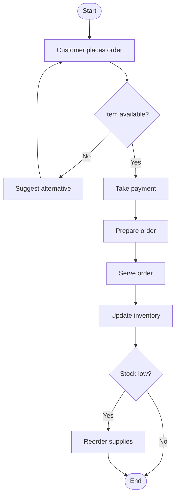

# Cafe Management Flowchart

```mermaid
flowchart TD
    A([Start]) --> B[Customer places order]
    B --> C{Item available?}
    C -- No --> D[Suggest alternative]
    D --> B
    C -- Yes --> E[Take payment]
    E --> F[Prepare order]
    F --> G[Serve order]
    G --> H[Update inventory]
    H --> I{Stock low?}
    I -- Yes --> J[Reorder supplies]
    I -- No --> K([End])
    J --> K
```
